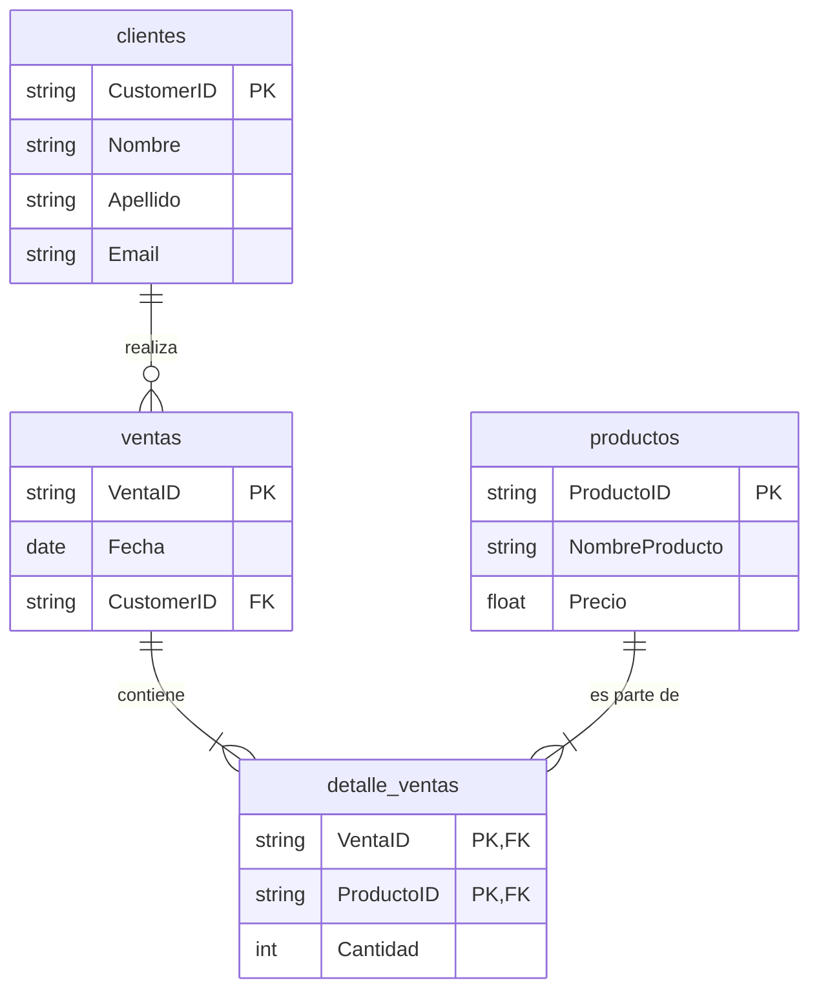

```mermaid
erDiagram
    clientes {
        string CustomerID PK
        string Nombre
        string Apellido
        string Email
    }
    ventas {
        string VentaID PK
        date Fecha
        string CustomerID FK
    }
    detalle_ventas {
        string VentaID PK, FK
        string ProductoID PK, FK
        int Cantidad
    }
    productos {
        string ProductoID PK
        string NombreProducto
        float Precio
    }

    clientes ||--o{ ventas : "realiza"
    ventas ||--|{ detalle_ventas : "contiene"
    productos ||--|{ detalle_ventas : "es parte de"
```
