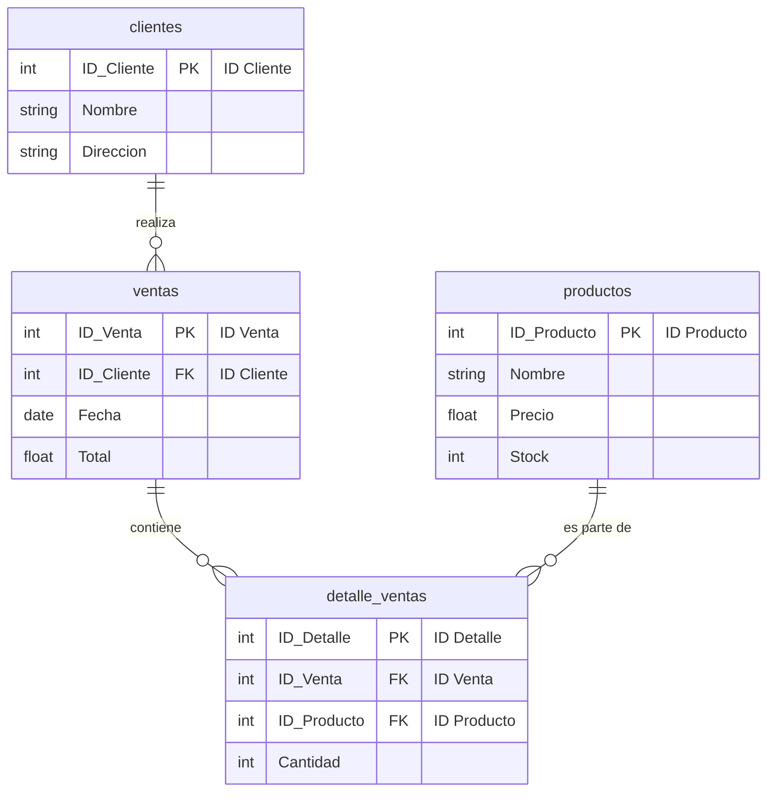

# Análisis de Ficheros de Datos: Aurelion

Este documento describe la estructura y propósito de los ficheros de datos en formato `.xlsx` encontrados en el proyecto.

## Descripción de los Ficheros

Basado en sus nombres, los ficheros representan una base de datos relacional simple:

1.  `clientes.xlsx`: Contiene la lista y los datos de todos los clientes. Cada fila representa un cliente único con su información (ID, nombre, etc.).

2.  `productos.xlsx`: Funciona como el catálogo de productos. Cada fila detalla un producto (ID, nombre, precio, stock, etc.).

3.  `ventas.xlsx`: Registra las transacciones de venta. Cada fila es una venta individual, vinculada a un cliente y con una fecha específica.

4.  `detalle_ventas.xlsx`: Es la tabla que conecta las ventas con los productos. Detalla qué productos y en qué cantidad se incluyeron en cada venta.

## ¿Están Normalizados?

**Sí, la estructura que sugieren los nombres de los ficheros indica que los datos están normalizados.**

La normalización es una práctica de diseño de bases de datos que busca organizar los datos para reducir la redundancia y mejorar su integridad. La estructura actual cumple con estos principios:

-   **No hay redundancia de datos:** En lugar de repetir la información completa de un producto en cada venta, se utiliza un `ID de producto` para referenciarlo. Lo mismo ocurre con los clientes.
-   **Separación de entidades:** Cada tipo de dato (cliente, producto, venta) tiene su propio fichero (tabla), lo que mantiene el modelo organizado.
-   **Relaciones mediante IDs:** Los ficheros se vinculan entre sí usando identificadores (IDs), lo cual es el fundamento de un modelo de datos relacional.

Para una confirmación definitiva sería necesario inspeccionar las columnas de cada fichero, pero la nomenclatura y la separación de los ficheros son un claro indicativo de un diseño de datos normalizado y eficiente.

## Diagrama de Entidad-Relación (Mermaid)

### Explicación del Diagrama:

*   `clientes ||--o{ ventas`: Un cliente puede realizar una o muchas ventas.
*   `ventas ||--o{ detalle_ventas`: Una venta contiene uno o muchos productos detallados.
*   `productos ||--o{ detalle_ventas`: Un producto puede ser parte de uno o muchos detalles de venta.

`PK` indica la Llave Primaria (el identificador único de cada tabla) y `FK` indica una Llave Foránea (el identificador que conecta con otra tabla).
